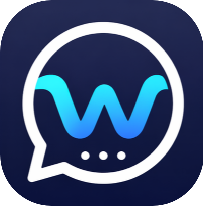
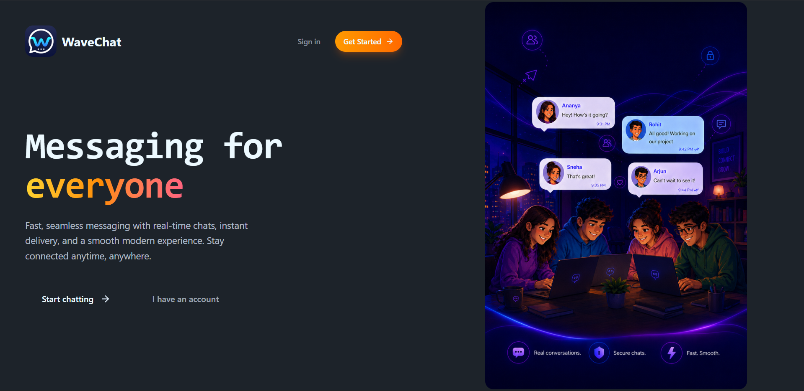
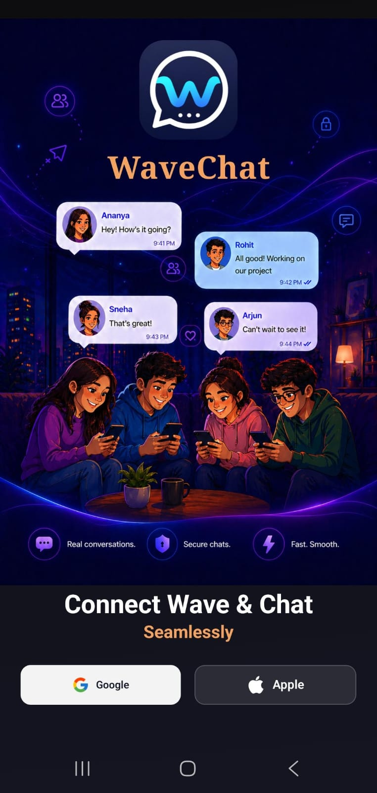
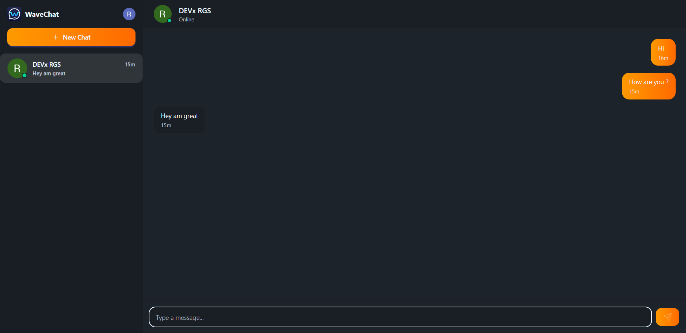
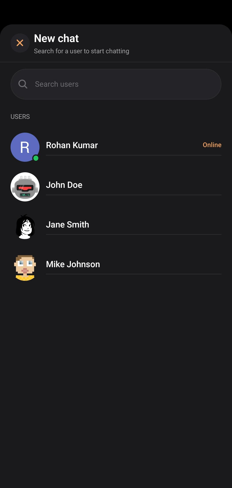

# WaveChat

WaveChat is a modern, real-time, cross-platform messaging application built to deliver a blazing-fast and seamless chat experience across both Web and Mobile devices. 

It features instant messaging, live typing indicators, online statuses, and robust user authentication, all wrapped in a premium dark-themed UI.

<div align="center">
  
</div>

---

## ✨ Features

- **Cross-Platform Ecosystem**: A fully synced experience across the React Web dashboard and the React Native iOS/Android app.
- **Real-Time WebSockets**: Instant message delivery with zero latency using Socket.io.
- **Live User Presence**: See who's online and exactly when they are actively typing.
- **Secure Authentication**: End-to-end user identity and session management powered by Clerk.
- **Responsive & Premium UI**: Built with Tailwind CSS, NativeWind, and carefully curated animations for a polished, modern feel.
- **Robust State Management**: Powered by React Query for server state and Zustand for global client state.

---

## 🛠️ Technology Stack

WaveChat was built with a modern, highly scalable JavaScript/TypeScript architecture:

### Frontend (Web)
- **Framework:** React + Vite
- **Styling:** Tailwind CSS + DaisyUI
- **Data Fetching:** TanStack React Query
- **State Management:** Zustand
- **Auth:** Clerk React

### Mobile App (iOS / Android)
- **Framework:** React Native + Expo Router
- **Styling:** NativeWind (Tailwind for React Native)
- **Data Fetching:** TanStack React Query
- **State Management:** Zustand
- **Auth:** Clerk Expo

### Backend
- **Runtime:** Bun + Express
- **Database:** MongoDB
- **Real-Time Engine:** Socket.io
- **Auth Sync:** Clerk Express SDK

---

## 🚀 Getting Started

To get a local copy up and running, follow these simple steps.

### Prerequisites
Make sure you have Bun installed on your machine.

### Installation

1. **Clone the repository:**
   ```bash
   git clone https://github.com/Devx-RGS/WaveChat.git
   cd WaveChat
   ```

2. **Setup the Backend:**
   ```bash
   cd backend
   bun install
   ```
   *Create a `.env` file in the backend directory with your `MONGODB_URI` and Clerk API keys.*

3. **Setup the Web App:**
   ```bash
   cd ../web
   bun install
   ```
   *Create a `.env` file with your `VITE_CLERK_PUBLISHABLE_KEY`.*

4. **Setup the Mobile App:**
   ```bash
   cd ../mobile
   bun install
   ```
   *Create a `.env` file with your Clerk Publishable Key and local API URL.*

### Running the Project

Start the development servers for all three environments:

**Backend:**
```bash
cd backend
bun run dev
```

**Web App:**
```bash
cd web
bun run dev
```

**Mobile App:**
```bash
cd mobile
bunx expo start
```

---

## 📸 Screenshots

| Web Application | Mobile Application |
| :---: | :---: |
|  |  |
|  |  |

